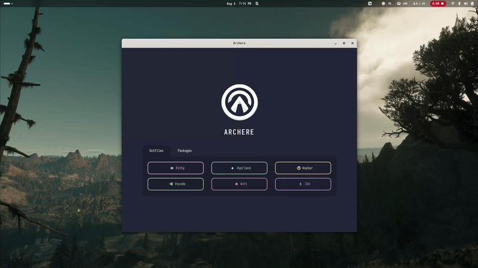

<p align="center">
  <a href="#about">About</a> •
  <a href="#usage">Usage</a> •
  <a href="#features">Key Features</a> •
  <a href="#future-plans">Future Plans</a> •
  <a href="#installation">Installation</a> •
  <a href="#license">License</a>
</p>

<h2 id="about">⭐ About</h2>

**Archere** is a user-friendly, customizable post-installation manager for Arch Linux, developed with [Tauri](https://tauri.studio/). It provides a simple graphical user interface (GUI) for installing and configuring packages after setting up your Arch Linux system.

<h2 id="usage">🚀 Usage</h2>

1. **Launch Archere**: Start the application and navigate through the intuitive UI.
2. **Select Packages**: Choose the packages you want to install or configure.
3. **Install**: Click the "Install" button and wait for the process to complete.

<h2 id="video">🎥 Video Demonstration</h2>

In the video below, you can see the user navigating through different categories and selecting packages to install. After pressing the *Install* button, the software prompts for the sudo password due to the use of pacman for package management. The installation then proceeds, and the installed programs are saved and marked as installed with a check indicator.

<p align="center">
  
</p>

<h2 id="features">🎯 Key Features</h2>

- Easy post install experience
- Customizable with css access
- Lightweight made with tauri
- Easy for add/remove packages
- Install only what you needs
- External scripts for better archlinux experience

<h2 id="future-plans">💡 Future Plans</h2>

- [ ] Add a dotfiles management section on the home page.
- [ ] Implement custom error messages in the frontend.
- [x] Fix Rust errors during pacman installation.
- [ ] Add a console in the frontend to display installation progress.
- [ ] Improve sudo permissions handling for each package.
- [x] Implement Catppuccin palette.

<h2 id="installation">🛠️ Installation</h2>

1. **Clone the repository:**
```bash
git clone https://github.com/kaloslazo/Archere.git
cd Archere
```

2. **Install dependencies**
```bash
npm install 
```

3. **Run tauri as development**
```bash
npm run tauri dev
```

<h2 id="license">📄 License</h2>

This project is licensed under the <a href="https://github.com/kaloslazo/Archere/blob/main/LICENSE">MIT License</a>.